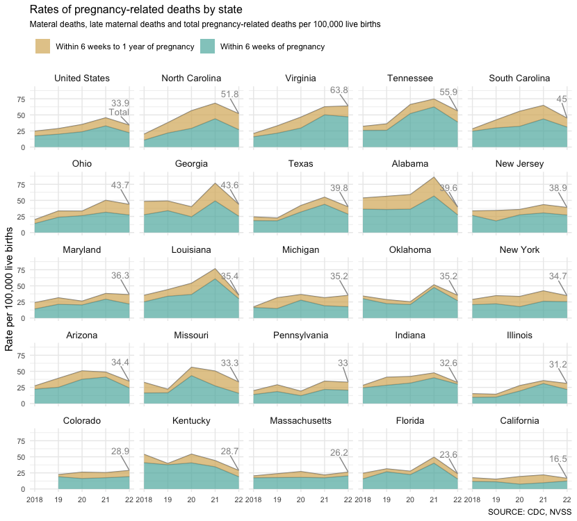

# Pregnancy-related deaths in North Carolina

[Initially prompted](https://github.com/MuckRock/maternal-mortality) by the release of data from the nonprofit journalism organization MuckRock, reporters at The News & Observer in early March set out to examine why more women in the U.S. and North Carolina are dying of pregnancy-related complications.

## Read the series

* [Pregnancy can be risky in the U.S. In North Carolina, the threat is even higher.](https://www.newsobserver.com/news/state/north-carolina/article277397263.html) July 19, 2023 // Teddy Rosenbluth & Tyler Dukes

* [Maternal deaths just ‘one part of the story’ in NC. Pregnancy complications are rising](https://www.newsobserver.com/news/state/north-carolina/article277056348.html) July 19, 2023 // Tyler Dukes & Teddy Rosenbluth

* [Weary of lopsided birth risks, Charlotte women expand care for Black women themselves](https://www.charlotteobserver.com/news/state/north-carolina/article276965933.html) July 19, 2023 // Lisa Vernon Sparks

* [Pregnancy-related deaths open voids in families expecting to celebrate new life](https://www.newsobserver.com/news/state/north-carolina/article277398108.html) July 19, 2023 // Tyler Dukes & Ethan Hyman

* [Five takeaways from investigating pregnancy-related deaths in NC](https://www.newsobserver.com/news/state/north-carolina/article277276748.html) July 20, 2023 // Tyler Dukes, Teddy Rosenbluth & Lisa Vernon Sparks

## How we did this story

National and international health agencies have slightly different ways to define pregnancy-related deaths.

The N&O used the definition of the [Centers for Disease Control and Prevention](https://www.cdc.gov/reproductivehealth/maternal-mortality/pregnancy-mortality-surveillance-system.htm#:~:text=defines%20a%20pregnancy%2Drelated%20death%20as%20a%20death%20while%20pregnant%20or%20within%201%20year%20of%20the%20end%20of%20pregnancy%20from%20any%20cause%20related%20to%20or%20aggravated%20by%20the%20pregnancy.) and [research by Marie Thoma](https://www.documentcloud.org/documents/23720948-changes_in_pregnancy_related_mortality_associated721), of the University of Maryland School of Public Health, which count as pregnancy-related any deaths "from any cause related to or aggravated by the pregnancy" within a year of being pregnant. This includes all death certificates with medical codes for obstetrical tetanus (ICD-10 codes A34) and diseases/injuries related to pregnancy, childbirth and the postpartum period (O00-O96 and O98-O99).

N&O reporters obtained data on these deaths – both for individual states and the U.S. overall – through the [CDC's online WONDER tool](https://wonder.cdc.gov/controller/saved/D158/D330F878) for the years 2018 to 2021. Data from years prior to 2018, experts said, were less reliable because of substantial changes in the way pregnancy-related deaths were tracked state by state.

Because the CDC suppresses death totals for some states where the figures are low enough to risk patient privacy, not all states are represented in the data. The CDC warns against comparisons and rankings state-by-state.

Rates are calculated per 100,000 live births, according to annual final reports from the [National Vital Statistics System](https://www.cdc.gov/nchs/nvss/births.htm).

The N&O used the same methodology to examine racial disparities in pregnancy-related deaths using both CDC data and the State Center for Health Statistics death certificate database through a 2020 data use agreement with the N.C. Department of Health and Human Services. In some cases, figures from this data, which only tracks the death of North Carolina residents who die in the state, differ slightly from data from the CDC, which counts deaths by residency regardless of where they died.

State Health Statistics death certificate data from 2022 is still preliminary.

To gauge the direct impact of the coronavirus pandemic, reporters also analyzed state death certificate data listing the medical code for COVID-19 (ICD-10 code U071) as a contributing cause of death along with a pregnancy-related underlying cause of death.

The N&O also obtained data from N.C. DHHS based on hospital discharges related to severe maternal morbidity. These so-called "near misses" occur when a pregnant woman almost dies from a list of serious maternal injuries or illnesses [defined by the Alliance for Innovation on Maternal Health](https://saferbirth.org/wp-content/uploads/AIM-SMM-Code-List_04042023.xlsx).

Severe maternal morbidity data from 2022 is still provisional.

## Get the data

The following files can be downloaded from the `data` directory in this repository. Full tables are below.

* [Pregnancy-related death counts and rates by state](/data/cdc_pregnancy_related_deaths2018_2021.csv) 
CDC data on the number of deaths due to ICD-10 codes associated with pregnancy-related injuries and illnesses up to a year after pregnancy for all states with data from 2018-2021.
* [Pregnancy-related death counts and rates in NC by race](/data/cdc_pregnancy_related_deaths2018_2021_nc_race.csv) 
CDC data on the number of deaths due to ICD-10 codes associated with pregnancy-related injuries and illnesses up to a year after pregnancy from 2018-2021 for non-Hispanic white and non-Hispanic Black residents of North Carolina. Live birth data comes from the National Vital Statistics System, and pregnancy-related death rates are calculated per 100,000 live births.
* [Pregnancy-related deaths and COVID](/data/nc_vital_pregnancy_related_deaths_covid2018_2021.csv) 
State death certificate data on the number of pregnancy-related deaths listing the ICD-10 code for COVID (U071) as a contributing cause of death along with a pregnancy-related underlying cause of death. *NOTE: 2022 data below from DHHS is preliminary as of July 2023 and is not final.*
* [Severe maternal morbidity counts for NC resident deliveries, 2018-2021](data/smm_data_26JUN2023.xlsx) 
N.C. DHHS data on severe maternal morbidity, based on hospital discharge data from 2018 to 2022, as of June 2023. *Note: The State Center for Health Statistics discharge data files are considered provisional and subject to change until they finalize their discharge data, which typically occurs within 2-3 years after the end of the calendar year.*

### Selected tables

#### Pregnancy-related death counts and rates by state

CDC data on the number of deaths due to ICD-10 codes associated with pregnancy-related injuries and illnesses up to a year after pregnancy for all states with data from 2018-2021. Live birth data comes from the National Vital Statistics System, and pregnancy-related death rates are calculated per 100,000 live births.

|Year |State          | Deaths|    Births|  Rate|
|:----|:--------------|------:|---------:|-----:|
|2018 |TOTAL          |    935| 3,791,712|  24.7|
|2019 |TOTAL          |  1,076| 3,747,540|  28.7|
|2020 |TOTAL          |  1,268| 3,613,647|  35.1|
|2021 |TOTAL          |  1,666| 3,664,292|  45.5|
|2018 |North Carolina |     24|   118,954|  20.2|
|2019 |North Carolina |     45|   118,725|  37.9|
|2020 |North Carolina |     66|   116,730|  56.5|
|2021 |North Carolina |     82|   120,466|  68.1|
|2018 |Alabama        |     31|    57,761|  53.7|
|2019 |Alabama        |     33|    58,615|  56.3|
|2020 |Alabama        |     34|    57,647|  59.0|
|2021 |Alabama        |     50|    58,054|  86.1|
|2018 |Arizona        |     22|    80,723|  27.3|
|2019 |Arizona        |     31|    79,375|  39.1|
|2020 |Arizona        |     39|    76,947|  50.7|
|2021 |Arizona        |     38|    77,916|  48.8|
|2018 |Arkansas       |     22|    37,018|  59.4|
|2019 |Arkansas       |     14|    36,564|  38.3|
|2020 |Arkansas       |     22|    35,251|  62.4|
|2021 |Arkansas       |     24|    35,965|  66.7|
|2018 |California     |     79|   454,920|  17.4|
|2019 |California     |     68|   446,479|  15.2|
|2020 |California     |     81|   420,259|  19.3|
|2021 |California     |     92|   420,608|  21.9|
|2018 |Florida        |     54|   221,542|  24.4|
|2019 |Florida        |     69|   220,002|  31.4|
|2020 |Florida        |     58|   209,671|  27.7|
|2021 |Florida        |    107|   216,260|  49.5|
|2018 |Georgia        |     61|   126,172|  48.3|
|2019 |Georgia        |     62|   126,371|  49.1|
|2020 |Georgia        |     49|   122,473|  40.0|
|2021 |Georgia        |     95|   124,073|  76.6|
|2018 |Illinois       |     22|   144,815|  15.2|
|2019 |Illinois       |     20|   140,128|  14.3|
|2020 |Illinois       |     37|   133,298|  27.8|
|2021 |Illinois       |     47|   132,189|  35.6|
|2018 |Indiana        |     23|    81,646|  28.2|
|2019 |Indiana        |     33|    80,859|  40.8|
|2020 |Indiana        |     33|    78,616|  42.0|
|2021 |Indiana        |     38|    79,946|  47.5|
|2018 |Kentucky       |     29|    53,922|  53.8|
|2019 |Kentucky       |     21|    53,069|  39.6|
|2020 |Kentucky       |     28|    51,668|  54.2|
|2021 |Kentucky       |     23|    52,214|  44.0|
|2018 |Louisiana      |     21|    59,615|  35.2|
|2019 |Louisiana      |     26|    58,941|  44.1|
|2020 |Louisiana      |     31|    57,328|  54.1|
|2021 |Louisiana      |     44|    57,437|  76.6|
|2018 |Maryland       |     17|    71,080|  23.9|
|2019 |Maryland       |     22|    70,178|  31.3|
|2020 |Maryland       |     18|    68,554|  26.3|
|2021 |Maryland       |     26|    68,285|  38.1|
|2018 |Michigan       |     19|   110,032|  17.3|
|2019 |Michigan       |     34|   107,886|  31.5|
|2020 |Michigan       |     38|   104,074|  36.5|
|2021 |Michigan       |     33|   104,980|  31.4|
|2018 |Minnesota      |     10|    67,344|  14.8|
|2019 |Minnesota      |     11|    66,027|  16.7|
|2020 |Minnesota      |     12|    63,443|  18.9|
|2021 |Minnesota      |     17|    64,425|  26.4|
|2018 |Mississippi    |     15|    37,000|  40.5|
|2019 |Mississippi    |     21|    36,636|  57.3|
|2020 |Mississippi    |     15|    35,473|  42.3|
|2021 |Mississippi    |     38|    35,156| 108.1|
|2018 |Missouri       |     24|    73,269|  32.8|
|2019 |Missouri       |     16|    72,127|  22.2|
|2020 |Missouri       |     39|    69,285|  56.3|
|2021 |Missouri       |     35|    69,453|  50.4|
|2018 |New Jersey     |     34|   101,223|  33.6|
|2019 |New Jersey     |     34|    99,585|  34.1|
|2020 |New Jersey     |     35|    97,954|  35.7|
|2021 |New Jersey     |     44|   101,497|  43.4|
|2018 |New York       |     65|   226,238|  28.7|
|2019 |New York       |     77|   221,539|  34.8|
|2020 |New York       |     70|   209,338|  33.4|
|2021 |New York       |     89|   210,742|  42.2|
|2018 |Ohio           |     27|   135,134|  20.0|
|2019 |Ohio           |     45|   134,461|  33.5|
|2020 |Ohio           |     43|   129,191|  33.3|
|2021 |Ohio           |     65|   129,791|  50.1|
|2018 |Oklahoma       |     17|    49,800|  34.1|
|2019 |Oklahoma       |     14|    49,143|  28.5|
|2020 |Oklahoma       |     12|    47,623|  25.2|
|2021 |Oklahoma       |     25|    48,410|  51.6|
|2018 |Pennsylvania   |     27|   135,673|  19.9|
|2019 |Pennsylvania   |     39|   134,230|  29.1|
|2020 |Pennsylvania   |     25|   130,693|  19.1|
|2021 |Pennsylvania   |     46|   132,622|  34.7|
|2018 |South Carolina |     16|    56,669|  28.2|
|2019 |South Carolina |     24|    57,038|  42.1|
|2020 |South Carolina |     31|    55,704|  55.7|
|2021 |South Carolina |     37|    57,185|  64.7|
|2018 |Tennessee      |     26|    80,751|  32.2|
|2019 |Tennessee      |     29|    80,450|  36.0|
|2020 |Tennessee      |     52|    78,689|  66.1|
|2021 |Tennessee      |     61|    81,717|  74.6|
|2018 |Texas          |     92|   378,624|  24.3|
|2019 |Texas          |     85|   377,599|  22.5|
|2020 |Texas          |    155|   368,190|  42.1|
|2021 |Texas          |    205|   373,594|  54.9|
|2018 |Virginia       |     21|    99,843|  21.0|
|2019 |Virginia       |     32|    97,429|  32.8|
|2020 |Virginia       |     44|    94,749|  46.4|
|2021 |Virginia       |     60|    95,825|  62.6|
|2018 |Washington     |     18|    86,085|  20.9|
|2019 |Washington     |     30|    84,895|  35.3|
|2020 |Washington     |     17|    83,086|  20.5|
|2021 |Washington     |     25|    83,911|  29.8|

#### Pregnancy-related death counts and rates in NC by race
CDC data on the number of deaths due to ICD-10 codes associated with pregnancy-related injuries and illnesses up to a year after pregnancy from 2018-2021 for non-Hispanic white and non-Hispanic Black residents of North Carolina. Live birth data comes from the National Vital Statistics System, and pregnancy-related death rates are calculated per 100,000 live births.

|year | Deaths, total| Births, total| Rate, total| Deaths, white| Births, white| Rate, white| Deaths, Black| Births, Black| Rate, Black|
|:----|-------------:|-------------:|-----------:|-------------:|-------------:|-----------:|-------------:|-------------:|-----------:|
|2018 |            24|       118,954|        20.2|            12|        63,514|        18.9|            10|        27,670|        36.1|
|2019 |            45|       118,725|        37.9|            16|        62,205|        25.7|            21|        27,733|        75.7|
|2020 |            66|       116,730|        56.5|            18|        60,518|        29.7|            39|        27,228|       143.2|
|2021 |            82|       120,466|        68.1|            36|        63,239|        56.9|            30|        27,028|       111.0|

#### Pregnancy-related deaths and COVID
State death certificates data on the number of pregnancy-related deaths listing the ICD-10 code for COVID (U071) as a contributing cause of death along with a pregnancy-related underlying cause of death. *NOTE: 2022 data below from DHHS is preliminary as of July 2023 and is not final.*

|Year | COVID listed| COVID not listed| Deaths, total|
|:----|------------:|----------------:|-------------:|
|2018 |            0|               19|            19|
|2019 |            0|               43|            43|
|2020 |            3|               63|            66|
|2021 |           26|               53|            79|
|*2022* |            *5*|               *51*|            *56*|

## 2024 update
In May 2024, the Centers for Disease Control and Prevention updated its online WONDER tool with new mortality data through 2022. The News & Observer is working to update its 2023 analysis of pregnancy-related deaths with this new data, using a similar methodology noted above.

*NOTE: Data below is PRELIMINARY and still subject to fact-checking and verification.*

### Pregnancy-related death rates nationally, by state

States not shown in the table had their pregnancy-related death counts suppressed by the CDC due to low numbers and privacy concerns.

### Pregnancy-related death rates nationally, by state
In many states, rates of pregnancy-related deaths dropped in 2022 following peaks during the COVID-19 pandemic. States not shown in the table had their pregnancy-related death counts suppressed by the CDC due to low numbers and privacy concerns.

|state          | 2018| 2019| 2020| 2021| 2022|
|:--------------|----:|----:|----:|----:|----:|
|United States  | 24.7| 28.7| 35.1| 45.5| 33.9|
|Virginia       | 21.0| 32.8| 46.4| 62.6| 63.8|
|Tennessee      | 32.2| 36.0| 66.1| 74.6| 55.9|
|**North Carolina** | **20.2**| **37.9**| **56.5**| **68.1**| **51.8**|
|South Carolina | 28.2| 42.1| 55.7| 64.7| 45.0|
|Ohio           | 20.0| 33.5| 33.3| 50.1| 43.7|
|Georgia        | 48.3| 49.1| 40.0| 76.6| 43.6|
|Texas          | 24.3| 22.5| 42.1| 54.9| 39.8|
|Alabama        | 53.7| 56.3| 59.0| 86.1| 39.6|
|New Jersey     | 33.6| 34.1| 35.7| 43.4| 38.9|
|Maryland       | 23.9| 31.3| 26.3| 38.1| 36.3|
|Louisiana      | 35.2| 44.1| 54.1| 76.6| 35.4|
|Michigan       | 17.3| 31.5| 36.5| 31.4| 35.2|
|Oklahoma       | 34.1| 28.5| 25.2| 51.6| 35.2|
|New York       | 28.7| 34.8| 33.4| 42.2| 34.7|
|Arizona        | 27.3| 39.1| 50.7| 48.8| 34.4|
|Missouri       | 32.8| 22.2| 56.3| 50.4| 33.3|
|Pennsylvania   | 19.9| 29.1| 19.1| 34.7| 33.0|
|Indiana        | 28.2| 40.8| 42.0| 47.5| 32.6|
|Illinois       | 15.2| 14.3| 27.8| 35.6| 31.2|
|Colorado       |   NA| 22.3| 26.0| 25.4| 28.9|
|Kentucky       | 53.8| 39.6| 54.2| 44.0| 28.7|
|Massachusetts  | 20.3|   NA| 27.1| 21.7| 26.2|
|Florida        | 24.4| 31.4| 27.7| 49.5| 23.6|
|California     | 17.4| 15.2| 19.3| 21.9| 16.5|
|Vermont        |  0.0|   NA|  0.0|  0.0|  0.0|
|Arkansas       | 59.4| 38.3| 62.4| 66.7|   NA|
|Washington     | 20.9| 35.3| 20.5| 29.8|   NA|

### Severe maternal morbidity, North Carolina

N.C. DHHS provided data on several maternal morbidity, excluding transfusions, by year from 2018 to 2022, as well as rates per 10,000 delivery hospitalizations in non-federal North Carolina hospitals, based on discharge data.

| Year | SMM cases | Deliveries | Rate
|:-----|----------:|-----------:|-----:|
|2018  | 790       | 109,726    | 72.0 |
|2019  | 837       | 108,873    | 76.9 |
|2020  | 931       | 108,213    | 86.0 |
|2021  | 1,151     | 111,991    | 102.8|
|2022  | 1,041     | 113,098    | 92.0 |

### Detailed table: Pregnancy-related death count by type, nationally, by state

States not shown in the table had their pregnancy-related death counts suppressed by the CDC due to low numbers and privacy concerns. States aren't included in this table unless they have three or more years of reported data.

|state          |type         | 2018| 2019| 2020| 2021| 2022|
|:--------------|:------------|----:|----:|----:|----:|----:|
|United States  |all_deaths   |  935| 1076| 1268| 1666| 1245|
|United States  |early_deaths |  658|  754|  861| 1205|  817|
|United States  |late_deaths  |  277|  322|  407|  461|  428|
|Virginia       |all_deaths   |   21|   32|   44|   60|   61|
|Virginia       |early_deaths |   16|   21|   28|   48|   45|
|Virginia       |late_deaths  |    5|   11|   16|   12|   16|
|Tennessee      |all_deaths   |   26|   29|   52|   61|   46|
|Tennessee      |early_deaths |   21|   21|   41|   51|   32|
|Tennessee      |late_deaths  |    5|    8|   11|   10|   14|
|**North Carolina** |**all_deaths**  |   **24**|   **45**|   **66**|   **82**|   **63**|
|**North Carolina** |**early_deaths** |   **13**|   **26**|   **34**|   **53**|   **33**|
|**North Carolina** |**late_deaths**  |   **11**|   **19**|   **32**|   **29**|   **30**|
|South Carolina |all_deaths   |   16|   24|   31|   37|   26|
|South Carolina |early_deaths |   14|   17|   18|   25|   18|
|South Carolina |late_deaths  |    2|    7|   13|   12|    8|
|Ohio           |all_deaths   |   27|   45|   43|   65|   56|
|Ohio           |early_deaths |   19|   32|   34|   41|   35|
|Ohio           |late_deaths  |    8|   13|    9|   24|   21|
|Georgia        |all_deaths   |   61|   62|   49|   95|   55|
|Georgia        |early_deaths |   35|   43|   30|   61|   32|
|Georgia        |late_deaths  |   26|   19|   19|   34|   23|
|Texas          |all_deaths   |   92|   85|  155|  205|  155|
|Texas          |early_deaths |   70|   69|  118|  164|  111|
|Texas          |late_deaths  |   22|   16|   37|   41|   44|
|Alabama        |all_deaths   |   31|   33|   34|   50|   23|
|Alabama        |early_deaths |   21|   21|   21|   33|   16|
|Alabama        |late_deaths  |   10|   12|   13|   17|    7|
|New Jersey     |all_deaths   |   34|   34|   35|   44|   40|
|New Jersey     |early_deaths |   27|   18|   27|   31|   28|
|New Jersey     |late_deaths  |    7|   16|    8|   13|   12|
|Maryland       |all_deaths   |   17|   22|   18|   26|   25|
|Maryland       |early_deaths |   10|   15|   14|   20|   15|
|Maryland       |late_deaths  |    7|    7|    4|    6|   10|
|Louisiana      |all_deaths   |   21|   26|   31|   44|   20|
|Louisiana      |early_deaths |   15|   20|   21|   35|   17|
|Louisiana      |late_deaths  |    6|    6|   10|    9|    3|
|Michigan       |all_deaths   |   19|   34|   38|   33|   36|
|Michigan       |early_deaths |   18|   16|   29|   20|   18|
|Michigan       |late_deaths  |    1|   18|    9|   13|   18|
|Oklahoma       |all_deaths   |   17|   14|   12|   25|   17|
|Oklahoma       |early_deaths |   15|   11|   10|   23|   13|
|Oklahoma       |late_deaths  |    2|    3|    2|    2|    4|
|New York       |all_deaths   |   65|   77|   70|   89|   72|
|New York       |early_deaths |   47|   49|   37|   55|   53|
|New York       |late_deaths  |   18|   28|   33|   34|   19|
|Arizona        |all_deaths   |   22|   31|   39|   38|   27|
|Arizona        |early_deaths |   18|   20|   29|   32|   19|
|Arizona        |late_deaths  |    4|   11|   10|    6|    8|
|Missouri       |all_deaths   |   24|   16|   39|   35|   23|
|Missouri       |early_deaths |   12|   12|   30|   19|   11|
|Missouri       |late_deaths  |   12|    4|    9|   16|   12|
|Wisconsin      |all_deaths   |   NA|   NA|   NA|   17|   20|
|Wisconsin      |early_deaths |   NA|   NA|   NA|   12|   12|
|Wisconsin      |late_deaths  |   NA|   NA|   NA|    5|    8|
|Pennsylvania   |all_deaths   |   27|   39|   25|   46|   43|
|Pennsylvania   |early_deaths |   19|   25|   16|   29|   27|
|Pennsylvania   |late_deaths  |    8|   14|    9|   17|   16|
|Indiana        |all_deaths   |   23|   33|   33|   38|   26|
|Indiana        |early_deaths |   20|   23|   25|   32|   24|
|Indiana        |late_deaths  |    3|   10|    8|    6|    2|
|Illinois       |all_deaths   |   22|   20|   37|   47|   40|
|Illinois       |early_deaths |   14|   14|   26|   41|   28|
|Illinois       |late_deaths  |    8|    6|   11|    6|   12|
|Colorado       |all_deaths   |   NA|   14|   16|   16|   18|
|Colorado       |early_deaths |   NA|   12|   10|   11|   12|
|Colorado       |late_deaths  |   NA|    2|    6|    5|    6|
|Kentucky       |all_deaths   |   29|   21|   28|   23|   15|
|Kentucky       |early_deaths |   22|   20|   21|   18|   10|
|Kentucky       |late_deaths  |    7|    1|    7|    5|    5|
|Massachusetts  |all_deaths   |   14|   NA|   18|   15|   18|
|Massachusetts  |early_deaths |   12|   NA|   12|   12|   14|
|Massachusetts  |late_deaths  |    2|   NA|    6|    3|    4|
|Florida        |all_deaths   |   54|   69|   58|  107|   53|
|Florida        |early_deaths |   35|   59|   47|   87|   35|
|Florida        |late_deaths  |   19|   10|   11|   20|   18|
|California     |all_deaths   |   79|   68|   81|   92|   69|
|California     |early_deaths |   53|   50|   32|   41|   52|
|California     |late_deaths  |   26|   18|   49|   51|   17|
|Vermont        |all_deaths   |    0|   NA|    0|    0|    0|
|Vermont        |early_deaths |    0|   NA|    0|    0|    0|
|Vermont        |late_deaths  |    0|   NA|    0|    0|    0|
|Arkansas       |all_deaths   |   22|   14|   22|   24|   NA|
|Arkansas       |early_deaths |   17|   12|   15|   19|   NA|
|Arkansas       |late_deaths  |    5|    2|    7|    5|   NA|
|Mississippi    |all_deaths   |   NA|   21|   15|   38|   NA|
|Mississippi    |early_deaths |   NA|   15|   10|   29|   NA|
|Mississippi    |late_deaths  |   NA|    6|    5|    9|   NA|
|Utah           |all_deaths   |   NA|   14|   NA|   16|   NA|
|Utah           |early_deaths |   NA|   11|   NA|   13|   NA|
|Utah           |late_deaths  |   NA|    3|   NA|    3|   NA|
|Washington     |all_deaths   |   18|   30|   17|   25|   NA|
|Washington     |early_deaths |   13|   23|   16|   17|   NA|
|Washington     |late_deaths  |    5|    7|    1|    8|   NA|